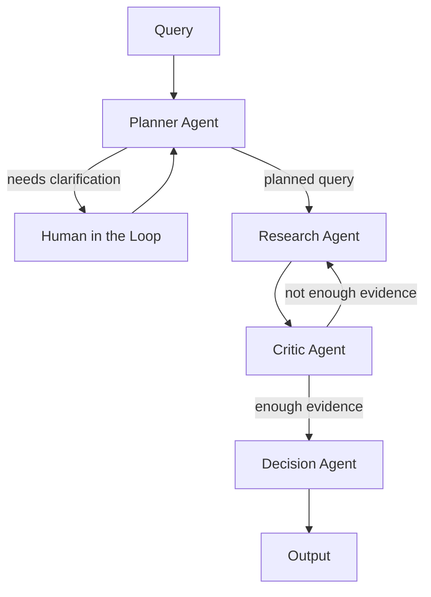

# TradePilot AI

TradePilot AI is a multi-agent stock analysis system built for IEOR 4576 Project 3. It answers questions such as:

- "Should I buy Apple this week?"
- "Compare Nvidia vs AMD."
- "Why did NVDA move today?"
- "Summarize Nvidia news from yesterday."

The system combines market data, company news, fundamentals, sentiment analysis, chart generation, and a multi-step reasoning loop. It is designed for informational stock analysis only. It does not provide personalized financial advice or future price predictions.

## Project 3 Submission Notes

- Live URL: `TODO - add deployed public URL before final submission`
- Demo surface:
  - `GET /` serves the frontend UI
  - `POST /chat`, `POST /chat/start`, and `POST /chat/resume` power the agent backend


## Class Concepts Used

TradePilot clearly uses these class topics:

1. `LLMs`
   The project uses OpenAI-backed planner, research, critic, and decision helpers, plus optional LLM news summarization, in [app/agents/llm_planner.py](app/agents/llm_planner.py), [app/agents/llm_research.py](app/agents/llm_research.py), [app/agents/llm_critic.py](app/agents/llm_critic.py), [app/agents/llm_decision.py](app/agents/llm_decision.py), and [app/skills/news.py](app/skills/news.py).
2. `Context Engineering`
   The system uses role-specific prompts, structured instructions, JSON-only output constraints, and schema-aware prompting in [app/prompts/](app/prompts), [app/skills/schema.py](app/skills/schema.py), and the LLM helper modules under [app/agents/](app/agents).
3. `Evaluation`
   Benchmark-based scoring for intent, tool usage, evidence coverage, stop reasons, and end-to-end success is implemented in [tests/evals/benchmark_cases.py](tests/evals/benchmark_cases.py), [tests/evals/benchmark_eval.py](tests/evals/benchmark_eval.py), and [tests/evals/test_benchmark_eval.py](tests/evals/test_benchmark_eval.py).
4. `Tool Calling`
   The research agent executes structured skill calls for `news`, `market`, `fundamentals`, `sentiment`, and `chart` in [app/agents/research_agent.py](app/agents/research_agent.py) using the registry in [app/skills/registry.py](app/skills/registry.py).
5. `Frameworks`
   LangGraph is used as the agent framework for graph execution, interruptions, and resume flow in [app/graph/tradepilot_graph.py](app/graph/tradepilot_graph.py), [app/graph/runtime.py](app/graph/runtime.py), and [requirements.txt](requirements.txt).
6. `Multi-Agent Patterns`
   The system is explicitly organized as a planner -> research -> critic -> decision pipeline with retry loops in [app/orchestrator.py](app/orchestrator.py), [app/graph/tradepilot_graph.py](app/graph/tradepilot_graph.py), and [app/agents/](app/agents).
7. `Context, State & Memory`
   Shared pipeline state, thread state, and per-agent metadata are managed in [app/state.py](app/state.py), [app/graph/state_schema.py](app/graph/state_schema.py), and [app/graph/runtime.py](app/graph/runtime.py).
8. `Agents as Functions`
   Each agent is exposed as a reusable function that transforms shared state, making the pipeline easy to orchestrate and test in [app/agents/planner_agent.py](app/agents/planner_agent.py), [app/agents/research_agent.py](app/agents/research_agent.py), [app/agents/critic_agent.py](app/agents/critic_agent.py), [app/agents/decision_agent.py](app/agents/decision_agent.py), and [app/orchestrator.py](app/orchestrator.py).

TradePilot does not currently implement `RAG`, `Text-to-SQL`, or `Claude Code` concepts, so they are not claimed here.

## What The System Does

TradePilot currently supports:

- single-stock informational buy/hold/sell-style signals
- company comparisons
- explanation and research-style answers
- chart-ready price trend output
- human clarification when the query is ambiguous
- out-of-scope rejection for unrelated queries

The backend returns both:

- a user-facing `answer`
- a structured `state` object for debugging, evaluation, and demos

### Structure Flow Chart



### Default Iteration Budget

The system currently defaults to `3` research/critic iterations.

## Hybrid Agent Design

Planner, Research, Critic, and Decision are all hybrid:

- try LLM first when enabled and `OPENAI_API_KEY` is available
- fall back to deterministic behavior if the LLM call fails, times out, or returns invalid JSON

This lets the system stay runnable even without OpenAI access.

### How LLM Output Is Constrained

Each LLM-based helper uses 3 layers of control:

1. a role-specific system prompt
2. `response_format={"type":"json_object"}` in the OpenAI API request
3. strict code-side parsing and normalization

If the returned JSON is malformed or does not match the expected schema, the system discards it and falls back to deterministic behavior.

## Agents

### 1. Planner Agent

Main responsibilities:

- classify the user query
- infer ticker(s)
- infer time horizon
- decide which evidence types are required
- decide whether human clarification is needed
- detect out-of-scope queries

Possible intents:

- `buy_sell_decision`
- `comparison`
- `explanation`
- `general_research`

Important current behavior:

- explanation-style queries such as "Why did NVDA move today?" and "Summarize Nvidia news from yesterday" are routed away from the recommendation flow
- only `buy_sell_decision` and `comparison` go through the Decision Agent

LLM planner prompt:

- [app/prompts/planner_prompt.py](app/prompts/planner_prompt.py)

LLM planner helper:

- [app/agents/llm_planner.py](app/agents/llm_planner.py)

Main planner logic:

- [app/agents/planner_agent.py](app/agents/planner_agent.py)

### 2. Research Agent

Main responsibilities:

- fetch and structure evidence
- execute skill/tool calls
- optionally use an LLM to produce a structured research plan
- directly execute critic-directed follow-up steps on retry passes

Current research modes:

- `llm`
- `deterministic_only`
- `deterministic_fallback`
- `critic_follow_up`

Important current behavior:

- first pass can be LLM-planned or deterministic
- later passes can be critic-directed
- if the critic returns exact follow-up steps, research executes them directly instead of replanning

LLM research prompt:

- [app/prompts/research_prompt.py](app/prompts/research_prompt.py)

LLM research helper:

- [app/agents/llm_research.py](app/agents/llm_research.py)

Main research logic:

- [app/agents/research_agent.py](app/agents/research_agent.py)

### 3. Critic Agent

Main responsibilities:

- judge whether the evidence is enough
- distinguish structural sufficiency from semantic sufficiency
- identify missing evidence, conflicts, and fairness issues
- propose follow-up steps for the next research iteration

Current critic behavior is hybrid:

- deterministic critic handles hard structural checks
- LLM critic handles semantic sufficiency and richer retry guidance

The critic returns fields such as:

- `enough_evidence`
- `blocking_missing`
- `supporting_missing`
- `semantic_enough`
- `quality_issues`
- `llm_follow_up_steps`

Important current behavior:

- the critic can now return exact follow-up tool calls with parameters
- research can execute those directly on the next loop

LLM critic prompt:

- [app/prompts/critic_prompt.py](app/prompts/critic_prompt.py)

LLM critic helper:

- [app/agents/llm_critic.py](app/agents/llm_critic.py)

Main critic logic:

- [app/agents/critic_agent.py](app/agents/critic_agent.py)

### 4. Decision Agent

Main responsibilities:

- turn structured evidence into a final recommendation or comparison
- keep the scoring logic deterministic
- optionally use an LLM to improve wording and synthesis

Current behavior:

- deterministic scoring decides recommendation, confidence, risk, and combined score
- LLM overlay improves reasoning text and key-driver wording

LLM decision prompt:

- [app/prompts/decision_prompt.py](app/prompts/decision_prompt.py)

LLM decision helper:

- [app/agents/llm_decision.py](app/agents/llm_decision.py)

Main decision logic:

- [app/agents/decision_agent.py](app/agents/decision_agent.py)

## Skills

Registered production skills live in:

- [app/skills/registry.py](app/skills/registry.py)

Current skill set:

- `news`
- `market`
- `fundamentals`
- `sentiment`
- `chart`

### Data Sources And Models

- `Finnhub`
  - company news
  - company profile
  - basic financials

- `yfinance`
  - recent price history
  - market history used for trend and chart generation

- `FinBERT`
  - article-level and aggregate sentiment analysis

- `OpenAI`
  - optional LLM planner/research/critic/decision behavior
  - optional news summarization

## Shared Skill Schema

The system has a central skill schema registry:

- [app/skills/schema.py](app/skills/schema.py)

This schema describes:

- each skill's purpose
- supported inputs
- outputs
- dependencies
- quality hints

This is used in prompt construction for the LLM Research and LLM Critic paths so they know what tools exist and what parameters are valid.

## Shared State

All agents operate on a shared state object built in:

- [app/state.py](app/state.py)

The state tracks:

- query and user inputs
- intent
- tickers
- time horizon
- plan
- evidence
- critic result
- decision
- confidence
- guardrails
- per-agent metadata

Important metadata fields include:

- `planner_mode`
- `research_mode`
- `critic_mode`
- `decision_mode`
- `planner_reasoning_brief`
- `research_reasoning_brief`
- `critic_reasoning_brief`
- `decision_reasoning_brief`
- `research_plan_steps`
- `executed_research_steps`
- `iterations_used`
- `stopped_reason`

## Retry And Follow-Up Step Flow

The retry logic is now explicit.

### First Pass

1. Planner decides intent and evidence categories.
2. Research gathers initial evidence.
3. Critic evaluates sufficiency.

### Follow-Up Passes

If the critic says evidence is insufficient, it can return structured follow-up steps like:

```json
[
  {"skill": "sentiment", "ticker": "NVDA", "params": {}},
  {"skill": "news", "ticker": "NVDA", "params": {"days": 2, "max_items": 6}},
  {"skill": "market", "ticker": "NVDA", "params": {"lookback_days": 14}}
]
```

On the next iteration, the Research Agent:

- reads those follow-up steps from the previous critic result
- executes them directly
- does not ask the research LLM to reinterpret them first

This cleanly separates:

- first-pass exploratory research
- later targeted retry research

## Explanation Queries Vs Recommendation Queries

The system now distinguishes between:

- recommendation queries
- explanation/research queries

### Recommendation Flow

Queries like:

- "Should I buy Apple this week?"
- "Compare Nvidia vs AMD."

go through the Decision Agent.

### Explanation / Research Flow

Queries like:

- "Why did NVDA move today?"
- "Summarize Nvidia news from yesterday."

do not go through the Decision Agent. They return:

- a research-style answer
- market context
- company context
- critic evidence notes when the evidence remains thin

This logic is implemented in:

- [app/orchestrator.py](app/orchestrator.py)
- [app/response.py](app/response.py)

## API

FastAPI app:

- [app/main.py](app/main.py)

### Endpoints

- `GET /health`
- `POST /chat`

### Request Body

```json
{
  "query": "Why did NVDA move today?",
  "ticker": null
}
```

### Response Shape

```json
{
  "query": "...",
  "ticker": null,
  "answer": "...",
  "charts": [],
  "state": {}
}
```

## Setup

### 1. Create a Virtual Environment

```powershell
python -m venv .venv
.venv\Scripts\Activate.ps1
```

### 2. Install Dependencies

```powershell
pip install -r requirements.txt
```

Dependencies are listed in:

- [requirements.txt](requirements.txt)

### 3. Configure Environment Variables

Copy `.env.example` to `.env` and fill in your keys.

Current `.env` fields:

- `FINNHUB_API_KEY`
- `OPENAI_API_KEY`
- `OPENAI_NEWS_MODEL`
- `USE_LLM_PLANNER`
- `OPENAI_PLANNER_MODEL`
- `USE_LLM_RESEARCH`
- `OPENAI_RESEARCH_MODEL`
- `USE_LLM_CRITIC`
- `OPENAI_CRITIC_MODEL`
- `USE_LLM_DECISION`
- `OPENAI_DECISION_MODEL`
- `YFINANCE_CACHE_DIR`

Behavior:

- if `OPENAI_API_KEY` is present, hybrid agents default to LLM-first mode
- you can force deterministic behavior by setting a specific `USE_LLM_*` flag to `false`

## Running The App

Start the backend:

```powershell
uvicorn app.main:app --reload
```

Then open:

- `http://127.0.0.1:8000/`
- `http://127.0.0.1:8000/docs`

## Useful Demo Queries

### Recommendation

```json
{"query":"Should I buy the iPhone company this week?","ticker":null}
```

### Comparison

```json
{"query":"Compare Nvidia vs AMD","ticker":null}
```

### Explanation

```json
{"query":"Why did NVDA move today?","ticker":null}
```

### News Summary

```json
{"query":"Summarize Nvidia news from yesterday","ticker":null}
```

### Out Of Scope

```json
{"query":"What is the weather in New York tomorrow?","ticker":null}
```

## Testing

Run the benchmark eval test set:

```powershell
python -m unittest tests.evals.test_benchmark_eval -v
```

The benchmark suite is built from fixed query cases in [tests/evals/benchmark_cases.py](tests/evals/benchmark_cases.py) and scored by pure logic in [tests/evals/benchmark_eval.py](tests/evals/benchmark_eval.py). It evaluates the pipeline against structured ground truth rather than free-form answer wording.

### Benchmark Metrics

The current benchmark layer reports these metrics:

1. `Intent Accuracy %`
   Measures whether the system classified the query into the correct intent.

   Formula:
   ```text
   intent_accuracy_pct =
   (# cases with correct intent / total # cases) * 100
   ```

2. `Ticker Accuracy %`
   Measures whether the system identified the correct ticker list.

   Formula:
   ```text
   ticker_accuracy_pct =
   (# cases with correct tickers / total # cases) * 100
   ```

3. `Stop Reason Accuracy %`
   Measures whether the pipeline finished in the expected state such as `decision_completed`, `research_completed`, `human_clarification_required`, or `out_of_scope`.

   Formula:
   ```text
   stop_reason_accuracy_pct =
   (# cases with correct stop reason / total # cases) * 100
   ```

4. `Right Tool Call %`
   Measures how often the system called the tools that a benchmark case required. This is the main tool-selection score.

   Per-case formula:
   ```text
   right_tool_call_pct =
   (# required tools actually called / total # required tools) * 100
   ```

   Aggregate formula:
   ```text
   right_tool_call_pct =
   (total required-tool hits across all cases / total required-tool expectations) * 100
   ```

5. `Wrong Tool Call %`
   Measures how much of the executed tool usage was explicitly wrong for the benchmark case. Lower is better.

   Per-case formula:
   ```text
   wrong_tool_call_pct =
   (# forbidden tools called / total # called tools) * 100
   ```

   Aggregate formula:
   ```text
   wrong_tool_call_pct =
   (total forbidden-tool hits across all cases / total # called tools across all cases) * 100
   ```

6. `Evidence Coverage %`
   Measures whether the final state actually contains the evidence types the case required, such as `market`, `news`, `sentiment`, `fundamentals`, or `chart`.

   Formula:
   ```text
   evidence_coverage_pct =
   (# required evidence types present / total # required evidence types) * 100
   ```

7. `End-to-End Success %`
   Measures the percentage of benchmark cases that pass all important checks together.

   A case passes only if:
   - intent is correct
   - tickers are correct
   - stop reason is correct
   - all required tools were called
   - no forbidden tools were called
   - all required evidence is present

   Formula:
   ```text
   end_to_end_success_pct =
   (# fully passing cases / total # cases) * 100
   ```

### Reading The Scores

- High `Right Tool Call %` means the agent is selecting the tools it should use.
- Low `Wrong Tool Call %` means the agent is avoiding unnecessary or inappropriate tool calls.
- High `Evidence Coverage %` means the state ends with the evidence the benchmark expected.
- High `End-to-End Success %` means the whole pipeline is behaving correctly on the benchmark set, not just one isolated agent.

## Repository Layout

```text
tradepilot-ai/
|-- app/
|   |-- main.py
|   |-- orchestrator.py
|   |-- response.py
|   |-- state.py
|   |-- agents/
|   |   |-- planner_agent.py
|   |   |-- research_agent.py
|   |   |-- critic_agent.py
|   |   |-- decision_agent.py
|   |   |-- llm_planner.py
|   |   |-- llm_research.py
|   |   |-- llm_critic.py
|   |   `-- llm_decision.py
|   |-- prompts/
|   |   |-- planner_prompt.py
|   |   |-- research_prompt.py
|   |   |-- critic_prompt.py
|   |   `-- decision_prompt.py
|   `-- skills/
|       |-- registry.py
|       |-- schema.py
|       |-- news.py
|       |-- market.py
|       |-- fundamentals.py
|       |-- sentiment.py
|       |-- chart.py
|       |-- compliance.py
|       |-- finnhub_tool.py
|       `-- yfinance_tool.py
|-- frontend/
|-- demos/
|-- tests/
|   |-- unit/
|   `-- evals/
|-- README.md
|-- requirements.txt
|-- Dockerfile
`-- cloudbuild.yaml
```


## Disclaimer

TradePilot AI is for educational and informational use only. It does not provide personalized investment advice, guarantee future performance, or replace professional financial judgment.
